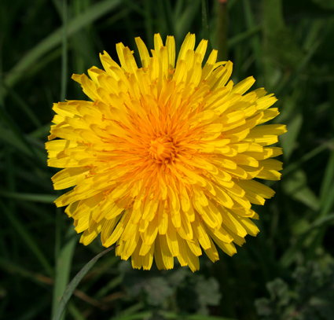
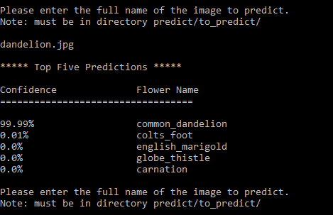

# Deep Learning Flower Classification
This project utilizes a convolutional neural network to be able to classify between 102
different species of flowers with a practical accuracy of about 96%. With the power of
TensorFlow and Google's own Inception v3 model trained on the ImageNet dataset allowed this
classifier to attain a high accuracy with little data. When passed an image, it
 will predict what it thinks the flower is along with the other top four predictions. 
The goal of this project was to 
serve as an entry point into the rapidly expanding field of machine learning while
using modern libraries and methods to gain familiarity with them.


### Authors and Project Location

**Authors:**

Steven Bouwkamp - https://github.com/bouwkast

Andy Vuong - https://github.com/VectorConvoy

Matt Schuch - https://github.com/RobinGoodfellow8b

Project Located at - https://github.com/bouwkast/CIS365-Project3

This was a collaborative, final project for Grand Valley State University's 
Artificial Intelligence class with Professor Jared Moore.


## Getting Started
The dataset that was used can be found [here](http://www.robots.ox.ac.uk/~vgg/data/flowers/102/)
if it is desired to train a model with the project.

With the dataset will come a MatLab file that explains the splits of data that was used. 
It is necessary to restructure the data into two separate directories _train_ and _validation_
and in both directories will be subdirectories for each flower class.

Within the file _mat\_reader.py_ can be found an example that can be used to restructure 
the dataset, but may have to be modified for different systems.

### Dependencies

Python v3.5.x

Keras v2.0.2
```markdown
pip install keras==2.0.2
```

numpy v1.11.1
```markdown
pip install numpy==1.11.1
```

scipy v0.17.1
```markdown
pip install scipy==0.17.1
```

**One of: _tensorflow_ or _tensorflow-gpu_**

_tensorflow-gpu_ recommended if training and an Nvidia GPU with CUDA support is available
to you.

tensorflow v1.0.1
```markdown
pip install tensorflow==1.0.1
```

tensorflow-gpu v1.0.1
```markdown
pip install tensorflow-gpu==1.0.1
```

**Additional dependencies for tensorflow-gpu**

[NVIDIA GPU Computing Toolkit](https://developer.nvidia.com/cuda-downloads)

[NVIDIA cudNN library](https://developer.nvidia.com/cudnn)


### Training a Model

There are two possible models that can be trained with this project: one that we call
a _from scratch_ model and one that fine-tunes Google's Inception v3 model.

_classifier.py_ will train a brand new model on the images that are found from the dataset.
Since there isn't much data, it will perform unsatisfactorily and will get around a 50% 
accuracy over the 102 different flowers.

_pretrained.py_ will train a model, but will use the the Inception v3 architecture as the 
basis of the model. This allows the model to use Inception's excellent simple feature
extraction layers that it gets from the ImageNet dataset and is able to apply it to
these flowers. The top 2 Inception blocks will be fine-tuned and backpropagation will
stop before getting to the earlier layers. This is a recommendation to help prevent
overfitting the model. This model should receive about an accuracy of **96%** after 
several hundred epochs - some tuning of training parameters may be necessary to improve
further or to speed up training.

### Predicting on an Image

Our trained model using the Inception v3 architecture can be downloaded from
 [here](https://drive.google.com/file/d/0B-xwCRwCIzyuVXA4bk5QTWs2aW8/view?usp=sharing)
 
After obtaining the model (either ours or your own trained model) run

```markdown
python predictor.py
```

It may take a bit to load, but it will ask for a model to load. It is expecting 
the model to be named _102_model.h5_ if yours is a different name either update
_predictor.py_ to reflect this or simply rename your model.
 
 Enter in the name of the model when asked to do so and it will probably take around
 30s to load. 
 
 Depending on the version of TensorFlow there may be reported errors, which are graphical
 bugs with TensorFlow - simply ignore them.
 
 After the model is loaded it will ask for the full name of an image to predict:
 
 _Note: the image must be within the **predict/to_predict/** directory_
 
 An example will be given below
 
 <p align="center">
    
 </p>
 
  <p align="center">
    
 </p>
 
 
### Possible Improvements

This project is lacking one major aspect: more data

As with many machine learning applications they can always be improved easily
by providing more data to it. This project is no different. Having only 8000 images
spread unequally between over 100 classes is actually not that many images per class. 

On top of having few images there are also low quality images in the dataset along with
images of flowers at the exact same angle.

Typically people don't take a photo of a single image looking directly at it.

Incorporating multiple images at different angles of varying group size of the flowers
will be an easy way to vastly improve the model's accuracy and prediction capabilities.